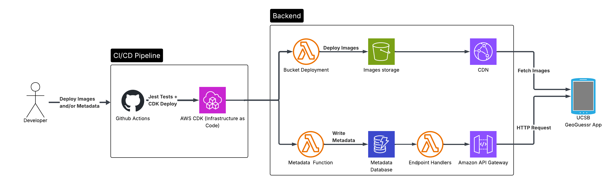

# GeoGuessr Clone

- The main UCSBGeoGuessr repo is private, so this contains my backend
  contributions + additional changes for fun.
- This version deploys images of tourist attractions sourced from Wikidata (the original used proprietary UCSB campus images).

## Architecture

- **Image delivery:** S3 for image storage + Cloudfront for delivery and caching

- **Metadata API:** API Gateway as proxy + Lambda for endpoint logic + Dynamo DB for metadata storage
  
- **Deployment:** Images deployed via GitHub Actions -> CDK deploys, uploading images to S3 and Metadata to DDB via Lambdas

## Design Decisions

- **Why serverless?:** Zero infrastructure to manage, scales to zero when unused, and pay-per-request pricing keeps costs near $0 for a low-traffic project.

- **Why CloudFront for serving images?:** CloudFront is the AWS-recommended approach for serving static content from S3, providing edge caching and lower latency.

- **Why GitHub Actions?:** GitHub Actions was the most accessible CI/CD tool for our team. It runs Jest tests on every PR to catch breaking changes and automates image and metadata deployment on merge to main.

- **Why DynamoDB over RDS?:** DynamoDB's pay-per-request pricing makes it ideal for a low-traffic project. RDS would offer more flexible querying with SQL, but requires paying for a running instance, making it hard to justify for a project at this scale.
